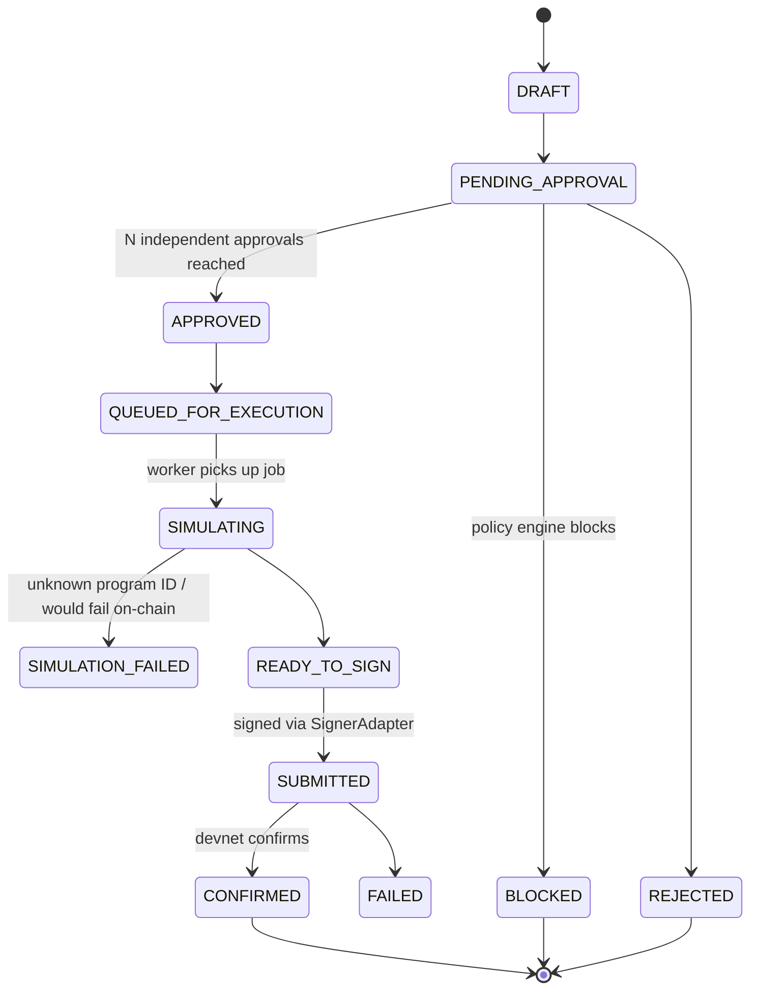
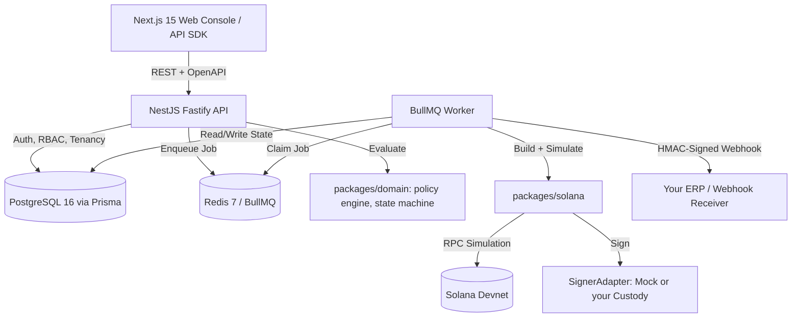

# Atlas Rail

**Atlas Rail is an open-source, self-hostable policy engine for Solana stablecoin payouts** — the governance layer that sits between "we approved this payment" and "this payment left the treasury." It gives finance and engineering teams programmable spend limits, multi-person approval, pre-flight transaction simulation, an append-only audit ledger, and HMAC-signed webhooks, without ever taking custody of a private key.

If you've ever had to explain to a CFO why "just send it from the multisig" isn't an internal control, this is the layer you were missing.

[](https://github.com/Rime504/atlas-rail/actions)
[](LICENSE)
[](https://solana.com)
[](https://www.typescriptlang.org/)
[](https://nodejs.org)

---

## Table of Contents

- [The Problem](#the-problem-a-wallet-is-not-a-treasury)
- [What Atlas Rail Is](#what-atlas-rail-is)
- [Where It Sits in the Stack](#where-it-sits-in-the-stack)
- [Safety Boundary — Read This First](#-safety-boundary--read-this-first)
- [How a Payout Actually Moves](#how-a-payout-actually-moves)
- [Core Capabilities](#core-capabilities)
- [Architecture](#architecture)
- [Repository Layout](#repository-layout)
- [Quick Start](#quick-start)
- [Who This Is For](#who-this-is-for)
- [Roadmap](#roadmap)
- [Security](#security)
- [Contributing](#contributing)
- [License](#license)

---

## The Problem: A Wallet Is Not a Treasury

Solana settles a token transfer in under a second for a fraction of a cent. That's the easy part, and it's been solved for years. The part that's still genuinely hard — the part every fintech and Web3 payroll team rebuilds from scratch — is everything *around* the transfer:

- Who is allowed to initiate a $50,000 vendor payout, and who has to independently sign off on it before it happens?
- What stops someone from quietly paying an unverified wallet, or blowing through a monthly spend limit?
- How do you know a transaction will actually succeed — hitting the right program IDs, the right token account — *before* you commit to it on-chain?
- If a request gets retried by a flaky network client, how do you guarantee the recipient doesn't get paid twice?
- When the auditor or the board asks "show me everything that happened to this payment," what do you hand them?
- How does your accounting system find out a payout cleared, without you polling an API in a loop?

A raw wallet — even a well-run multisig — answers none of these questions on its own. Teams either bolt together a policy layer in-house (slowly, and usually without an audit trail worth showing a regulator) or accept the risk. Atlas Rail is that policy layer, already built, open source, and yours to run.

## What Atlas Rail Is

Atlas Rail is a **policy-controlled treasury and stablecoin payout platform for Solana**. It is not a wallet, not a custodian, and not a multisig implementation. It's the orchestration and governance layer that sits in front of whichever signer you already trust — a mock signer for development, and a pluggable adapter interface for your HSM, MPC custody provider, or hardware-backed key management in production.

Every payout that passes through Atlas Rail is:

1. **Evaluated** against a declarative, versioned spend policy (limits, recipient risk, program allowlists).
2. **Routed** through an explicit approval queue with independent-approver enforcement.
3. **Simulated** against Solana devnet before anything is signed, with every instruction's program ID checked against an allowlist.
4. **Executed** through a durable background worker — not inline in an HTTP request — with retries and confirmation polling.
5. **Recorded** to an append-only ledger and audit trail, and announced to your systems via a signed webhook.

None of this is novel finance theory. It's the same control pattern every serious payment processor and bank enforces internally — implemented in the open, for Solana, so you don't have to build it under deadline pressure.

## Where It Sits in the Stack

Atlas Rail deliberately does **not** compete with your custody or signing infrastructure — it governs it.

```
┌─────────────────────────────────────────────────────────────┐
│  Your ERP / accounting system  (QuickBooks, NetSuite, Xero…) │
└───────────────────────────▲────────────────────────────────┘
                             │ HMAC-signed webhooks
┌────────────────────────────┴───────────────────────────────┐
│                        ATLAS RAIL                            │
│   policy engine · approvals · simulation · audit ledger      │
│         (this repository — self-hosted, open source)         │
└───────────────────────────┬────────────────────────────────┘
                             │ SignerAdapter interface
┌────────────────────────────┴───────────────────────────────┐
│  Your key custody: Fireblocks / Squads / Turnkey / your HSM  │
└───────────────────────────▲────────────────────────────────┘
                             │
                        Solana network
```

That's a deliberate design decision, not a missing feature. Every credible piece of financial infrastructure separates "who decides this payment should happen" from "who holds the key that makes it happen" — Atlas Rail owns the first half and stays out of the second entirely (see [Safety Boundary](#-safety-boundary--read-this-first) below). If you already trust a custody provider, Atlas Rail gives you the governance layer they don't provide. If you're evaluating one, Atlas Rail lets you build and test that governance layer today, against devnet, without waiting on a vendor contract.

---

## ⚠️ Safety Boundary — Read This First

> **Atlas Rail v1 is a Solana DEVNET-only policy sandbox. It is not connected to mainnet-beta, and it does not custody real funds.**

This isn't a disclaimer buried in the fine print — it's enforced in code, at every layer:

| Layer | Enforcement |
|---|---|
| Environment validation | Server refuses to boot if `SOLANA_RPC_URL` contains `mainnet` |
| Solana RPC client | `assertNotMainnet()` guard rejects any mainnet-beta endpoint at construction time |
| Signing | `MockDevnetSignerAdapter` generates ephemeral, disposable devnet keypairs — it hard-throws if `NODE_ENV=production` or `ATLAS_ALLOW_MOCK_SIGNER` isn't explicitly `true` |
| Key custody | Atlas Rail **never** collects, stores, transmits, or logs a private key, in any environment |
| UI | Every screen carries a persistent "DEVNET ONLY — Simulation environment" banner |

Production key handling is intentionally left to an `ExternalCustodySignerAdapter` interface, documented as a stub — you wire it up to your own KMS, HSM, or MPC custody provider. Shipping this against real funds requires your own security audit, legal review, and a real signer integration. We say that plainly because a treasury tool that hides its limitations is worse than one that has none — see [`docs/security/threat-model.md`](docs/security/threat-model.md) and [`docs/adr/0003-signer-boundary.md`](docs/adr/0003-signer-boundary.md) for the full reasoning.

---

## How a Payout Actually Moves

Every payout is an explicit, auditable state machine — not an implicit "pending → done":



Concretely, that means:

1. **Draft & policy preview** — an operator drafts a payout; the policy engine evaluates it *before* submission so the UI can show "this will need 2 approvals" or "this exceeds your daily limit" up front, not after the fact.
2. **Independent approval** — approvers with the `payout:approve` permission sign off. A policy can require the creator can't approve their own payout, and can require any number of independent approvers.
3. **Handoff to the worker** — approval doesn't execute anything inline. The API enqueues a job to a BullMQ queue and returns immediately; a separate worker process claims it.
4. **Simulation before signing** — the worker builds the actual SPL token transfer instruction (checked transfer, optional ATA creation, optional memo), and runs it through a simulator that inspects every instruction's program ID against an allowlist (`SystemProgram`, `TokenProgram`, `AssociatedTokenProgram`, `ComputeBudget`, `Memo`). Anything unrecognized blocks the payout — it never reaches a signer.
5. **Sign, submit, confirm** — signing happens exclusively behind the `SignerAdapter` interface. Confirmation is polled asynchronously, with retry and exponential backoff, not a blocking wait.
6. **Ledger, audit trail, and webhook** — every transition appends an immutable `AuditEvent`, every settled payout writes a `LedgerEntry`, and every lifecycle event (`payout.created`, `payout.approved`, `payout.submitted`, `payout.confirmed`, `payout.failed`, …) fires a webhook signed with `Atlas-Signature: t=<timestamp>,v1=<hmac>` — the same pattern Stripe and GitHub use for webhook verification.

## Core Capabilities

**Declarative, versioned spend policy** — every treasury has an active policy, evaluated deterministically against every payout:

```json
{
  "approval": { "requiredApprovals": 2, "preventCreatorApproval": true },
  "limits": {
    "maxSinglePayoutBaseUnits": "5000000000",
    "dailyLimitBaseUnits": "25000000000",
    "monthlyLimitBaseUnits": "100000000000"
  },
  "recipients": { "requireVerifiedRecipient": true },
  "transaction": { "requireSuccessfulSimulation": true, "blockUnknownProgramIds": true },
  "risk": { "blockHighRiskRecipients": true, "manualReviewAboveRiskLevel": "HIGH" }
}
```

- **Six-role RBAC out of the box** — `OWNER`, `ADMIN`, `OPERATOR`, `APPROVER`, `AUDITOR`, `DEVELOPER`, each mapped to a fine-grained permission set (treasury freeze, policy activation, payout approval, reconciliation export, API key management…) — not a single "admin" bit.
- **Idempotency by default** — every `POST /v1/payouts` requires an `Idempotency-Key` header; a retried request with the same key and payload replays the original response instead of creating a duplicate payout, and a reused key with a *different* payload is rejected outright.
- **Append-only financial ledger** — `LedgerEntry` and `AuditEvent` records are never mutated or deleted, and reconciliation exports to CSV on demand.
- **Signed, retried webhooks** — HMAC-SHA256, timestamped, with exponential backoff on delivery failure and per-attempt tracking, so your ERP integration doesn't have to poll.
- **Base-unit money math everywhere** — every amount is stored and computed as an integer base-unit string (`5000000` = `5.000000 USDC`), never a float, so rounding errors aren't a category of bug that can exist.

## Architecture

Atlas Rail is a TypeScript monorepo (pnpm workspaces + Turborepo) split into an API, a background worker, a web console, and a set of framework-agnostic domain packages.

| Layer | Technology | Why |
|---|---|---|
| API | NestJS on Fastify | Structured, testable modules; Fastify for throughput; OpenAPI/Swagger generated from the same decorators |
| Worker | BullMQ on Redis | Durable job queues with retry/backoff — execution and confirmation happen out-of-band, never inline in a request |
| Database | PostgreSQL 16 + Prisma | Strong typing end-to-end, migrations as code, 14 explicit models from `Organization` down to `IdempotencyRecord` |
| Domain logic | Plain TypeScript (`packages/domain`) | Policy engine, state machine, RBAC, and money math have zero framework dependencies — they're unit-testable in isolation and portable if you ever want them outside Nest |
| Solana integration | `@solana/web3.js` + `@solana/spl-token` | Devnet-guarded RPC client, checked-transfer instruction builder, simulator, and the signer adapter boundary |
| Web console | Next.js 15 (App Router) + Tailwind | The treasury operator's dashboard: draft, approve, watch simulation results, export reconciliation |



## Repository Layout

```
atlas-rail/
├── apps/
│   ├── web/           # Next.js 15 treasury console (draft, approve, monitor, export)
│   ├── api/            # NestJS Fastify REST API + OpenAPI/Swagger
│   └── worker/         # BullMQ queues: execution, confirmation, webhooks, reconciliation, housekeeping
├── packages/
│   ├── config/         # Env schema validation, safety constants, queue/event definitions
│   ├── database/       # Prisma schema, migrations, ULIDs, seed data
│   ├── domain/         # Policy engine, payout state machine, RBAC, money math, webhook signing
│   ├── solana/         # Devnet RPC client, SPL instruction builder, simulator, signer adapters
│   ├── api-client/     # TypeScript SDK for the Atlas Rail API
│   └── ui/             # Shared UI primitives, including the devnet safety banner
├── docs/                # Architecture, ADRs, security threat model, operations runbook
├── examples/            # Minimal Node API client and webhook receiver
├── docker-compose.yml   # Postgres, Redis, Mailpit, API, worker, web — one command up
└── Makefile
```

## Quick Start

**Prerequisites:** Node.js 22 LTS · pnpm 9+ · Docker Desktop

```bash
git clone https://github.com/Rime504/atlas-rail.git
cd atlas-rail
cp .env.example .env

make install
make up          # Postgres, Redis, Mailpit, API, worker, web
make db-migrate
make db-seed
make demo
```

| Service | URL |
|---|---|
| Web console | http://localhost:3000 |
| API | http://localhost:3001 |
| Swagger / OpenAPI docs | http://localhost:3001/docs |
| Mailpit (dev email preview) | http://localhost:8025 |

**Seeded demo accounts** (password: `ChangeMe_AtlasRail_DevOnly`) — walk the full lifecycle yourself:

| Role | Email | What they can do |
|---|---|---|
| Owner | `owner@atlasrail.local` | Full governance: policies, treasuries, API keys |
| Operator | `operator@atlasrail.local` | Draft payouts, register recipients |
| Approver | `approver1@atlasrail.local` / `approver2@atlasrail.local` | Independent approvals |
| Auditor | `auditor@atlasrail.local` | Read-only ledger + reconciliation export |
| Developer | `developer@atlasrail.local` | API key and webhook management |

```bash
make check   # typecheck + lint + full test suite
make test-unit
make build
```

## Who This Is For

- **Fintech and Web3 payroll/payout teams** who need real internal controls — approvals, limits, audit trails — around stablecoin disbursement, and don't want to build that governance layer from a blank file.
- **Solana-native companies and DAOs** evaluating what enterprise-grade treasury tooling looks like on Solana, before committing to a closed SaaS vendor or building in-house.
- **Engineers wiring up custody infrastructure** (Fireblocks, Squads, Turnkey, an in-house HSM) who need a governance and orchestration layer in front of it, with a clean `SignerAdapter` seam to plug into.
- **Anyone auditing or learning** what a production-shaped policy engine, approval workflow, and transaction simulation pipeline actually looks like in TypeScript, end to end, with tests.

## Roadmap

Atlas Rail ships its governance layer first, deliberately, because that's the part every team gets wrong under time pressure. The path outward:

- **v0.1** *(current)* — Devnet treasury controls: policy engine, multi-approval, idempotency, simulation, append-only ledgers, HMAC webhooks.
- **v0.2** — External customer-controlled signer / HSM integration reference implementation.
- **v0.3** — Controlled mainnet readiness assessment and formal threat modeling (not mainnet activation).
- **v0.4** — ERP and accounting connectors (QuickBooks, Xero, NetSuite).
- **v0.5** — Multi-RPC failover and slot-latency monitoring.
- **v1.0** — Enterprise release, gated on external legal, security, and custody audits.

See [`ROADMAP.md`](ROADMAP.md) for details.

## Security

Atlas Rail does not claim banking, money-transmitter, custody, or regulated-payments status. Read [`SECURITY.md`](SECURITY.md) and [`docs/security/threat-model.md`](docs/security/threat-model.md) before considering any production use. Report vulnerabilities privately — do not open a public issue for a security concern.

## Contributing

Contributions are welcome — see [`CONTRIBUTING.md`](CONTRIBUTING.md) for the workflow, and [`docs/adr/`](docs/adr/) for the reasoning behind the major architectural decisions before you propose changing them.

## License

[Apache License 2.0](LICENSE) — use it, self-host it, fork it, build a product on top of it.
