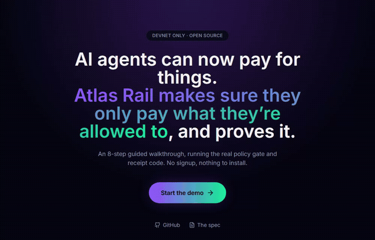
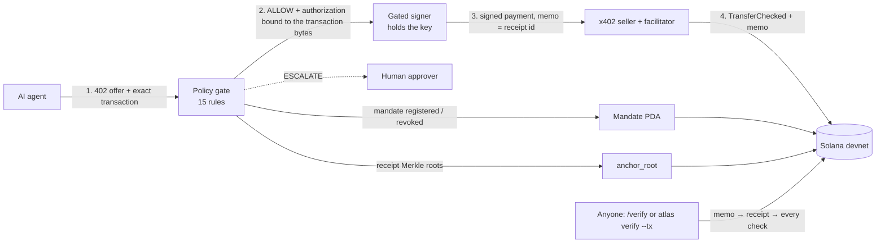

# Atlas Rail

**The authorization layer for AI agent payments on Solana.**
An open standard for delegated spending authority, a gate any agent or wallet can plug in, and proof anyone can check.

[](https://github.com/Rime504/atlas-rail/actions)
[](LICENSE)
[](#security)

### [▶ Try it](https://atlas-rail-playground.vercel.app) · [🔍 Verify a payment](https://atlas-rail-playground.vercel.app/verify) · [⚡ Integrate](#c-integrate-it)

- **The standard:** a mandate signed by the owner, an independent approver and the agent, and a proof-of-permission every payment carries ([spec](spec/agent-mandate-v0.1.md)).
- **The gate:** checks every payment against the mandate before any wallet signs. One line to integrate ([`wrapFetch`](docs/INTEGRATE.md#1-wrap-fetch-atlas-railagent)) or one MCP tool ([`pay`](docs/INTEGRATE.md#2-a-pay-tool-for-ai-assistants-atlas-rail-mcp)).
- **The proof:** every payment names its own receipt on Solana. Anyone can verify it at [/verify](https://atlas-rail-playground.vercel.app/verify) or with `atlas verify --tx`, without trusting us.

> [**51 attack types · 1,014 attempts · $0.00 moved, assuming a fully compromised agent**](reports/redteam-2026-10-08.md)<br>
> [**100 simultaneous payments vs a $5 cap → $5.00 (with our lock removed: $10.00)**](reports/redteam-2026-10-08.md#concurrency-100-simultaneous-payments-against-a-5-cap)<br>
> [**Pay, then verify from the chain on real devnet: PROVEN, 3 of 3**](reports/playground-live-2026-10-08.md)



## The problem

- AI agents can now pay for things on their own: an API answers `402 Payment Required` ([x402](https://x402.org)) and the agent pays.
- An agent can be tricked (a prompt injection on a web page) or overcharged (a seller quietly raising its price), and it pays anyway.
- Afterwards, nobody can prove what the agent was actually allowed to do.

## What Atlas Rail does

- **A signed mandate.** The owner, an independent approver and the agent itself each sign one document: which sellers, which resources, how much per payment, per hour and in total.
- **A 15-rule gate before any signature.** Every payment is checked against the mandate before the agent's wallet will sign it. The wallet refuses anything the gate did not approve, byte for byte.
- **Humans approve the edge cases.** Above a threshold, or for chosen resources, a person must approve that exact payment.
- **Every payment proves itself on Solana.** Each allowed payment names its own receipt in its on-chain memo. Anyone can paste the transaction into [Verify a payment](https://atlas-rail-playground.vercel.app/verify) and check, from the chain alone, who signed the mandate, the limits, the decision and the on-chain anchor.

## Who it's for

- **Agent builders**, who want their agent to pay for APIs without handing it a wallet it can drain.
- **Wallets and agent platforms**, which want to offer users safe spending limits for their agents without building the security themselves.
- **Sellers and API providers**, who want proof that a paying agent was actually allowed to pay.

## See it in 60 seconds

The [playground](https://atlas-rail-playground.vercel.app) runs the real gate and receipt code, no signup:

1. **Meet the agent:** a research agent with a wallet. Optionally switch on real Solana devnet.
2. **Give it rules:** owner, approver and agent sign the mandate; it is registered on-chain.
3. **A normal payment:** $0.01 to an approved seller, allowed.
4. **An attack:** a web page tells the agent to pay a stranger 500 USDC. Blocked before anything is signed.
5. **Price spike:** an approved seller raises its price. A small rise goes to a human; a 5x spike is refused.
6. **You are the human:** approve or reject the escalated payment.
7. **Proof:** every check on the receipt, and a button to verify the payment from the chain.
8. **Revoke:** the owner revokes; the very next payment is refused.

Then [try to break it](https://atlas-rail-playground.vercel.app/break): take over the agent and attack it yourself.

## Quickstart

### (a) Just look

Open [atlas-rail-playground.vercel.app](https://atlas-rail-playground.vercel.app). To check a real devnet payment, open [/verify](https://atlas-rail-playground.vercel.app/verify) and press any of the three examples.

### (b) Run everything locally

You need **Node.js 22 or newer**, **pnpm 9** and **Git**. No Docker and no devnet funds are needed for this path.

| OS | Install |
|---|---|
| Windows 10/11 | Node 22 LTS from [nodejs.org](https://nodejs.org), then in PowerShell: `corepack enable` |
| macOS | `brew install node@22`, then `corepack enable` |
| Linux | Node 22 via [nvm](https://github.com/nvm-sh/nvm) (`nvm install 22`), then `corepack enable` |

```bash
git clone https://github.com/Rime504/atlas-rail.git
cd atlas-rail
pnpm install
pnpm demo:rehearse
```

`demo:rehearse` builds the project, starts an embedded Postgres and an in-memory Solana cluster, and runs six scenes on its own: grant, pay, attack, escalate (approved automatically), prove, revoke. It ends with:

```
  Demo complete. Every scene behaved as designed.
```

`pnpm demo:offline` is the same but waits for you to approve the escalated payment in the console (`http://localhost:3000/approvals`, works on a phone). `pnpm demo` uses real Solana devnet; see [`docs/DEMO.md`](docs/DEMO.md).

Check any devnet payment from your terminal:

```bash
pnpm turbo run build --filter=@atlas-rail/cli...
node apps/cli/dist/main.js verify --tx 4RnVyRNTcssW1kAv9dL8xjbbhF8Ft6ZGomv7Msr1NGrTSgLKjQNafDcuK3B34ZVvmHYjhkfH78xZvG5PE5RiR1rU
```

It prints every check and ends with `PROVEN` (exit code 0), or `NO PROOF` for a payment Atlas Rail did not authorise (exit code 1).

### (c) Integrate it

Wrap your agent's `fetch`. On a `402` it asks the gate, gets the wallet to sign only what the gate approved, pays, and returns the receipt; a refusal throws `AtlasDenied` with the rules that refused it.

```ts
import { AtlasDenied, wrapFetch } from '@atlas-rail/agent';

const pay = wrapFetch(fetch, {
  mandateId: 'mnd_...',
  gate: { url: 'http://localhost:3001', apiKey: process.env.ATLAS_API_KEY! },
  wallet, // holds the agent key, outside the agent's process
  trustedInstanceKeys: ['<gate instance key>'],
});

const res = await pay('http://localhost:4402/research/summary'); // res.atlas.receipt: the proof
```

Or give an AI assistant one tool, `pay(url)`, over MCP (`apps/mcp`). The config for Claude Desktop and Claude Code, and how to get the gate running locally, are in [`docs/INTEGRATE.md`](docs/INTEGRATE.md). The packages are not published to npm yet; use them from this repository.

## How it works


```mermaid
graph LR
    A[AI agent] -->|"1. 402 offer + exact transaction"| G[Policy gate<br/>15 rules]
    G -->|"2. ALLOW + authorization bound to the transaction bytes"| S[Gated signer<br/>holds the key]
    G -.->|ESCALATE| H[Human approver]
    S -->|"3. signed payment, memo = receipt id"| X[x402 seller + facilitator]
    X -->|"4. TransferChecked + memo"| SOL[(Solana devnet)]
    G -->|mandate registered / revoked| PDA[Mandate PDA]
    G -->|receipt Merkle roots| ROOT[anchor_root]
    PDA --> SOL
    ROOT --> SOL
    V["Anyone: /verify or atlas verify --tx"] -->|"memo → receipt → every check"| SOL
```

Three layers:

1. **The mandate** ([`spec/agent-mandate-v0.1.md`](spec/agent-mandate-v0.1.md), `packages/mandate`): a JSON document, canonicalised and signed by owner, approver and agent, then registered in an on-chain account (program [`CnGoTE5B…LcY4k`](https://explorer.solana.com/address/CnGoTE5Bxc8MFGaeK5LDv5uAZ7pNiktMunYy8JZcLY4k?cluster=devnet)) so its existence and revocation can be checked without us.
2. **The gate and the gated signer** (`packages/mandate`, `packages/x402-client`): the gate evaluates every payment against the mandate and simulates the exact transaction; the signer only signs a transaction whose hash the gate authorised, in the last 120 seconds.
3. **The proof** (`packages/receipt`): each allowed payment gets a receipt binding mandate, offer, decision, settlement and response. Its id is in the payment's memo (unless the seller requires a memo of its own: the payment is then still valid, just not self-proving from the chain alone); receipts are batched into a Merkle tree whose root is written on-chain with `anchor_root`.

## Why Solana

- **Fast enough to sit in the payment path.** Measured on devnet: a gate decision takes p50 351 ms, p95 1,613 ms including a full transaction simulation; payment confirmation p50 1,646 ms ([report](reports/e2e-2026-10-08.md)).
- **Cheap enough to anchor every batch.** One `anchor_root` costs 10,822 compute units and a 5,000-lamport fee ([report](reports/e2e-2026-10-08.md)).
- **Money, rules and proof in one place.** The token transfer, the mandate account, the anchored receipt root and the memo pointing at the receipt are all readable from the same chain with one RPC endpoint.
- **Native primitives do the work.** `TransferChecked`, the Memo program and program-derived accounts. No bridge, no oracle, no extra chain.

## Proof, not promises

| What | Number | Source |
|---|---|---|
| Automated tests (CI) | 439 passing | `pnpm test`, [CI](https://github.com/Rime504/atlas-rail/actions) |
| Red team: fully compromised agent | 51 attack types, 1,014 attempts, **0 signatures obtained, $0.00 moved outside the mandate** | [reports/redteam-2026-10-08.md](reports/redteam-2026-10-08.md) |
| Red team on real devnet | 16 attack types, $0.00 moved outside the mandate | same report |
| 100 simultaneous payments vs a $5 cap | $5.00 spent (in-memory and Postgres); $10.00 with the lock removed | same report |
| Real devnet end-to-end run | all six scenes pass, memos match their receipts | [reports/e2e-2026-10-08.md](reports/e2e-2026-10-08.md) |
| Gate decision latency (devnet) | p50 351 ms, p95 1,613 ms | same report |
| `anchor_root` cost | 10,822 CU, 5,000 lamports | same report |
| Pay, then verify from the chain (live playground, real devnet) | PROVEN, 3 of 3, each re-read from a public RPC | [reports/playground-live-2026-10-08.md](reports/playground-live-2026-10-08.md) |
| On-chain program tests | 10 Rust unit + 27 LiteSVM integration | [`programs/atlas-mandate`](programs/atlas-mandate) |

The red team **assumes the agent is fully compromised on every attempt**: it sends any offer, transaction bytes or gate request the attacker wants, replays and tampers freely, and always tries to sign. It is stopped because it never holds the key.

## Business model (planned)

These are plans: nothing below earns money today.

- **The standard and the verifier are free and open.** Anyone can read the mandate format and check any receipt. Adoption comes first.
- **Hosted gate (paid).** Teams that don't want to run the gate themselves will pay per decision or a monthly plan.
- **Team features (paid).** Approvals from your phone, audit exports and spending reports for finance and compliance.
- **Licensing.** Wallets and agent platforms will be able to embed the gate in their own product.
- **Later: verification and agent risk scores.** Sellers will be able to check an agent's payment history before accepting a payment.

The more sellers ask for proof, the more agents need Atlas Rail, and the more agents carry proof, the more sellers can ask for it.

## Where the key lives

The guarantee depends on one thing: **the agent's key must live outside the agent's process.** A compromised agent that can read its own key can sign whatever it likes, and no gate can stop that.

The key lives in the **signer service** (`apps/signer`), a separate process the agent reaches only over HTTP. It does exactly three things: tell the agent its address; sign a transaction when handed the gate authorization for those exact bytes (with the signed ALLOW decision and mandate, re-checked); and sign the agent's own gate requests and mandate acceptance, in their exact Atlas Rail form. Nothing else: there is no route that signs arbitrary bytes, because a Solana payment signature is just a signature over the transaction's bytes. It binds to `127.0.0.1` and can require a bearer token.

`pnpm demo` starts the signer as its own process and the scripted agent signs only through it; `wrapFetch` and the MCP `pay` tool take its URL (see [`docs/INTEGRATE.md`](docs/INTEGRATE.md)). Two honest limits: on one machine under one user, the agent process could still read the devnet key file from disk, so real isolation needs a separate OS user, container or machine, or a custody provider running the same check (`GatedSignerAdapter` is the reference); and the red team's in-memory and devnet rigs call the signer in-process, modelling the attacker as controlling everything except the signer and its key.

## Security

**What it stops**, each with a test: payments to unlisted sellers or resources, amounts over any limit, price creep beyond the signed price, wrong asset or network, splitting a payment to dodge a limit, replayed or rejected approvals, replayed, stale, tampered or forged authorizations, payments after revocation or expiry, and concurrent bursts against a cap. See the [red-team report](reports/redteam-2026-10-08.md) and [`docs/THREAT_MODEL.md`](docs/THREAT_MODEL.md).

**Honest limits:**

- **Devnet only, unaudited.** The server refuses mainnet RPC endpoints; nothing here has had an external security audit.
- **Budgets are enforced by the gate, not by a token-program lock.** On-chain records of spend are records, not locks. A hard on-chain cap using native SPL token allowances is the next step, not built.
- **A window after revocation.** An authorization the gate issued just before a revocation can still be signed for up to 120 seconds.
- **The public receipt store is ours.** Receipts are served from this project's storage. A receipt JSON can always be verified on its own with `atlas verify <file>`, wherever it came from.
- **Devnet history is not forever.** Public devnet RPC nodes eventually drop old transactions and rate-limit busy periods; a check can fail for those reasons, not because a proof is wrong.

Thanks to **Divyesh** (on-chain engineer) for `anchor_root` and for finding and fixing: payout limits that ignored rolling spend (#37), an overspend window between reservation and release (#39), an unenforced recipient allowlist (#41), webhook SSRF to private hosts (#43), and a payout double-submit (#45).

Report vulnerabilities privately; see [`SECURITY.md`](SECURITY.md).

## Glossary

| Word | Meaning |
|---|---|
| Agent | A program, often driven by an AI model, that acts and pays on someone's behalf. |
| x402 | A web standard where a server answers `402 Payment Required` with a price, and the client pays to get the resource. |
| Mandate | The signed document that says what an agent may pay for, to whom, and how much. |
| Gate | The service that checks a payment against the mandate before it can be signed. |
| Receipt | A signed record tying one payment to its mandate, the gate's decision and the settlement. |
| Merkle root | One short hash that commits to a whole batch of receipts; any one receipt can be proven to be in the batch. |
| Devnet | Solana's public test network. Tokens there have no value. |
| PDA | A program-derived address: an on-chain account owned by a program, here the mandate's record. |
| Program | Code deployed on Solana. Atlas Rail's program records mandates and receipt batches. |
| Decision | The gate's answer to one payment: ALLOW, DENY or ESCALATE (send to a human). |
| Verifier | The tool that checks a receipt or a payment: [/verify](https://atlas-rail-playground.vercel.app/verify) or `atlas verify`. |
| MCP | Model Context Protocol: a standard way to give an AI assistant tools, here a `pay` tool. |
| SPL token | A token on Solana's standard token program. USDC on Solana is one. |
| Spending allowance | An amount a token account lets another key spend. The token program itself enforces it. |
| Sub-agent | An agent started by another agent to do part of its job. |
| Mainnet | Solana's real network, where tokens have real value. Atlas Rail refuses it today. |
| npm | The public registry JavaScript packages are installed from. |

## Repo map

| Path | What it is |
|---|---|
| `apps/playground` | The public walkthrough, `/verify` and `/break` (Next.js on Vercel) |
| `apps/cli` | `atlas verify` for receipt files and `--tx` signatures |
| `apps/mcp` | `atlas-rail-mcp`: an MCP server with one tool, `pay(url)` |
| `apps/signer` | `atlas-rail-signer`: the agent key in its own process, signing only what the gate authorised |
| `apps/api` | The gate and console API (NestJS) |
| `apps/web` | The owner and approver console (Next.js) |
| `apps/worker` | Background jobs: payouts, webhooks, receipt anchoring |
| `apps/demo-agent` | The scripted demo agent, the six-scene runner and the red team |
| `apps/demo-api` | A paid x402 API and facilitator, using the official x402 packages |
| `apps/mock-validator` | An in-memory Solana JSON-RPC cluster for offline runs |
| `apps/site` | The marketing site |
| `packages/mandate` | Mandates, the 15-rule gate, decisions, authorizations |
| `packages/receipt` | Receipts, Merkle batching, anchoring, verification, proof from a transaction |
| `packages/agent` | `wrapFetch` and `AtlasDenied`: the integration surface for agents |
| `packages/x402-client` | `createAtlasFetch` and the gated signer |
| `packages/solana` | Devnet client, transaction builders, the mandate program client |
| `packages/database` | Prisma schema and stores |
| `programs/atlas-mandate` | The Anchor program: `create_mandate`, `revoke_mandate`, `anchor_root` |
| `spec/` | The Agent Mandate v0.1 draft and its test vectors |

## Troubleshooting

- **`429 Too Many Requests` from devnet.** The public endpoint `api.devnet.solana.com` rate-limits. Wait a few seconds and retry, or set `SOLANA_RPC_URL` to a free devnet endpoint from an RPC provider.
- **Devnet faucet limits.** `pnpm demo` funds its keys from the public faucet with retries; if that is exhausted, use [faucet.solana.com](https://faucet.solana.com) for SOL and [faucet.circle.com](https://faucet.circle.com) for devnet USDC, or run `pnpm demo:rehearse`, which needs no devnet at all.
- **Windows.** Use PowerShell or Git Bash. If a previous run left a database process behind, the demo script stops it automatically; if not, end `postgres.exe` in Task Manager.
- **Ports in use.** The demo uses 3000 (console), 3001 (API), 4402 (paid API), 4022 (facilitator), 8899 (mock validator) and 54329 (embedded Postgres). Free them or stop the other program.

## Status and roadmap

### Built and tested today

- The mandate format, signed by the owner, an independent approver and the agent.
- A 15-rule gate before any signature. The wallet refuses anything the gate did not approve, byte for byte.
- Human approval bound to one exact payment: it can't be reused for a different amount, payee or payment.
- Receipts, batched and anchored on Solana (`anchor_root`).
- Self-proving payments: each allowed payment names its own receipt in its on-chain memo.
- Verify any payment from its transaction, at [/verify](https://atlas-rail-playground.vercel.app/verify) or with `atlas verify --tx`, backed by a public receipt store that only accepts receipts that pass every check.
- The on-chain mandate registry: registration and revocation recorded on devnet.
- Unknown payment outcomes resolved from the chain, never from the agent's word.
- The agent's key in a separate signer service, reached only over HTTP in `pnpm demo`.
- The red team (51 attack types, $0.00 moved outside the mandate) and the concurrency proof.
- `wrapFetch` and an MCP `pay` tool.
- The playground, running the real gate and receipt code.

### After the hackathon, in this order

1. **A hard cap enforced by Solana itself.** The agent will spend from a dedicated account through an SPL token spending allowance, so even a bypassed gate can't overspend. The on-chain work will be led by Divyesh.
2. **Budgets per task and per sub-agent.** Each job, and each helper agent, will get its own budget inside the mandate.
3. **Pinning the program version.** A mandate will name the exact program version it trusts.
4. **Solo mode.** The approver will be your own phone.
5. **Publishing `@atlas-rail/agent` on npm.**
6. **An external security audit, then mainnet.** Not before.
7. **First design partners.** We plan to invite agent builders and wallets to test it on devnet.

## Also in this repository: treasury payouts

Atlas Rail started as a policy layer for ordinary Solana treasury payouts, and the agent gate is built on the same engine: versioned spend policies, multi-person approval, pre-flight simulation, an append-only ledger and audit trail, idempotent APIs and signed webhooks, with a console for owners, approvers and auditors. Run it with Docker Compose (`make install && make up && make db-migrate && make db-seed`; the console is at `http://localhost:3000`) and see [`docs/architecture/`](docs/architecture/), [`docs/adr/`](docs/adr/) and [`docs/security/threat-model.md`](docs/security/threat-model.md).

## Team

- **Rime**, co-founder and lead engineer: designed and built Atlas Rail end to end.
- **Kamelia**, co-founder: the original idea, product and go-to-market.
- **Divyesh**, on-chain engineer: `anchor_root` and security review.

## Contributing

See [`CONTRIBUTING.md`](CONTRIBUTING.md) and the decisions in [`docs/adr/`](docs/adr/).

## License

[Apache 2.0](LICENSE).
