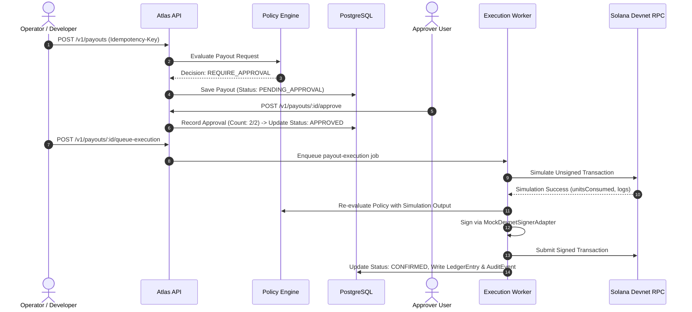

# Payout Lifecycle & State Machine Sequence

```mermaid
sequenceDiagram
    autonumber
    actor User as Operator / Developer
    participant API as Atlas API
    participant Engine as Policy Engine
    participant DB as PostgreSQL
    actor Approver as Approver User
    participant Worker as Execution Worker
    participant RPC as Solana Devnet RPC

    User->>API: POST /v1/payouts (Idempotency-Key)
    API->>Engine: Evaluate Payout Request
    Engine-->>API: Decision: REQUIRE_APPROVAL
    API->>DB: Save Payout (Status: PENDING_APPROVAL)
    Approver->>API: POST /v1/payouts/:id/approve
    API->>DB: Record Approval (Count: 2/2) -> Update Status: APPROVED
    User->>API: POST /v1/payouts/:id/queue-execution
    API->>Worker: Enqueue payout-execution job
    Worker->>RPC: Simulate Unsigned Transaction
    RPC-->>Worker: Simulation Success (unitsConsumed, logs)
    Worker->>Engine: Re-evaluate Policy with Simulation Output
    Worker->>Worker: Sign via MockDevnetSignerAdapter
    Worker->>RPC: Submit Signed Transaction
    Worker->>DB: Update Status: CONFIRMED, Write LedgerEntry & AuditEvent
```
